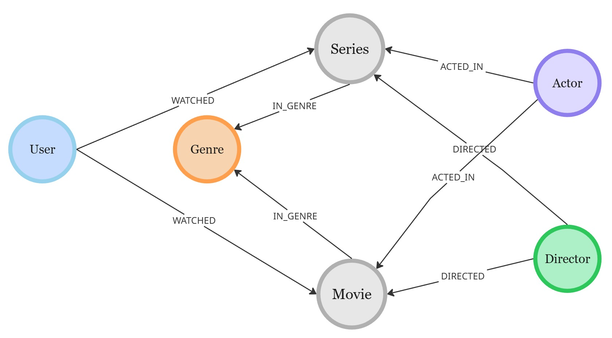
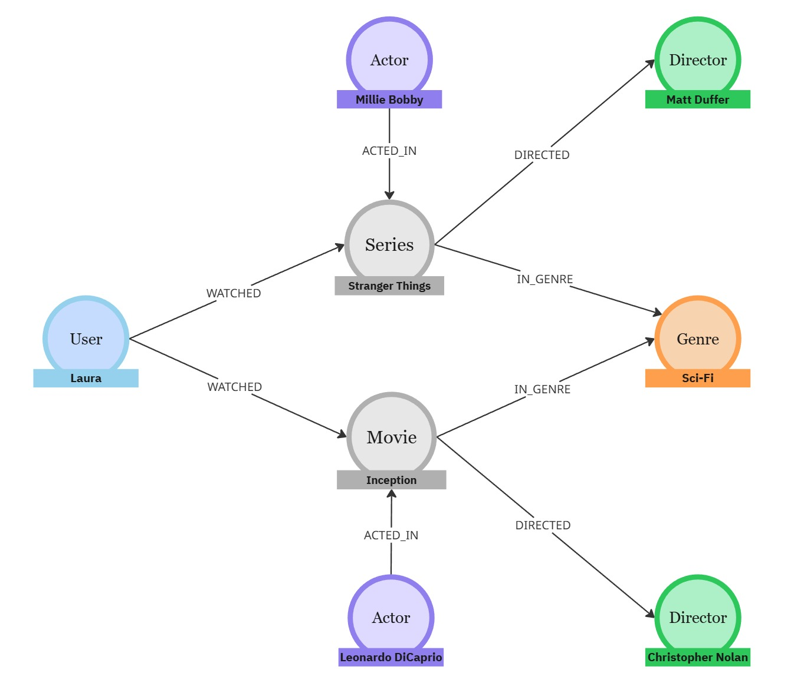

# 🎬 StreamingGraph: Data Model for a Streaming Platform
This repository contains the graph data model of a streaming platform, representing core domain entities such as Users, Movies, Series, Actors, Directors, and Genres.
The purpose of this model is to enable rich querying, analytics, and recommendation use-cases using graph technology—particularly Neo4j.

## 📌 Conceptual Model

The graph is composed of the following nodes and relationships:

### 🧩 Nodes

- User: Represents a user of the platform.
- Movie: Represents a movie.
- Series: Represents a TV series.
- Actor: Represents an actor/actress.
- Director: Represents a director.
- Genre: Represents a genre of content.

### 🔗 Relationships

(:User)-[:WATCHED]->(:Movie | :Series)
Indicates which content a user has watched.

(:Actor)-[:ACTED_IN]->(:Movie | :Series)
Connects actors to productions in which they performed.

(:Director)-[:DIRECTED]->(:Movie | :Series)
Connects directors to the content they directed.

(:Movie)-[:IN_GENRE]->(:Genre)

(:Series)-[:IN_GENRE]->(:Genre)
Assigns content to one or more genres.

## 🧱 Data Model Diagram



## 🔍 Useful Cypher Queries
Movies watched by a user

```cypher
MATCH (u:User {name: "Laura"})-[:WATCHED]->(m:Movie)
RETURN m.title;
```

Series an actor performed in

```cypher
MATCH (a:Actor {name: "Pedro Pascal"})-[:ACTED_IN]->(s:Series)
RETURN s.title;
```
## 🧱 Example Knowledge Graph with User Laura



## 👨‍💻 Developer

<p>
    
    <p>&nbsp&nbsp&nbspLaura Parra<br>
    &nbsp&nbsp&nbsp
    <a 
        href="https://github.com/lauraparra28">
        GitHub
    </a>
    &nbsp;|&nbsp;
    <a 
        href="https://linkedin.com/in/laura-milena-parra-navarro">
        LinkedIn
    </a>
</p>
</p>
<br/><br/>
<p>


